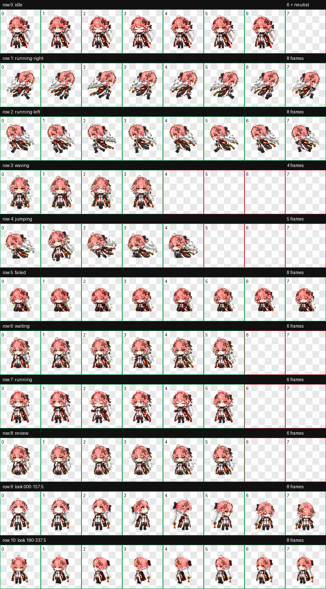
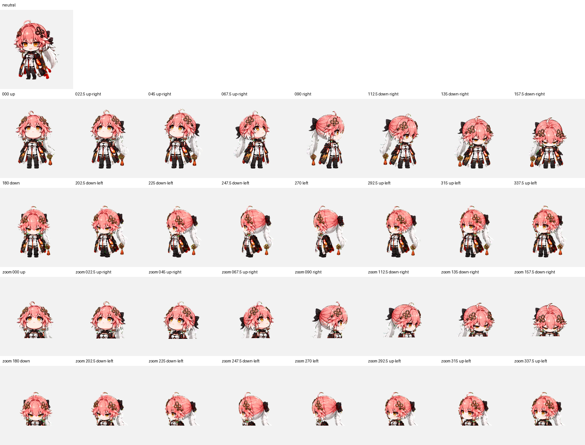

# 长离 Codex 桌宠

一个面向 Codex / ChatGPT 桌面端的《鸣潮》长离 Q 版动态桌宠项目。

项目包含可直接安装的 v2 桌宠包、9 组标准状态动画、16 个视线方向、完整生成提示词、布局参考、处理脚本与 QA 报告。最终图集已经在 Windows 版 Codex 桌面应用中完成本地安装和结构验证。

> 非官方、非商业同人项目。《鸣潮》、长离角色、角色设计、名称及相关游戏美术素材的版权与其他知识产权均归库洛游戏所有。© KURO GAMES. All rights reserved. 本项目与库洛游戏不存在隶属、授权或背书关系；详情见 [NOTICE.md](NOTICE.md)。

## 效果预览

### 完整 8×11 动画图集



### 16 个视线方向



这 16 帧不是 16 种行走方向，而是 Codex Pets v2 图集预留的视线方向帧。它们按顺时针 22.5° 步进描绘角色的眼睛和头部朝向，既不会增加新的任务状态，也不需要用户手动切换。

> 当前限制（2026-07）：本地 v2 图集与方向素材均已通过验证，但 Codex Desktop 尚未将普通物理鼠标、内置 Browser Use 或本地 Computer Use 的输入稳定地传给 Look 事件。因此这 16 帧是已完成的预留素材，暂时不会在日常使用中可靠播放。详见 [CHANGELOG.md](CHANGELOG.md) 与 [docs/AGENT_HANDOFF.md](docs/AGENT_HANDOFF.md)。

## 项目介绍

Codex Pets 会根据聊天任务状态切换动画，例如任务处理中、等待输入、完成待查看和失败。本项目把长离设计成适合 `192×208` 单元格显示的 Q 版角色，并制作成桌面端本地自定义 Pet。

主要特性：

- Q 版长离角色，金色眼睛、粉色短发、耳后至后颈高度的单一低位马尾。
- 9 组标准动画状态，共 57 个标准动画帧。
- 16 个顺时针视线方向。
- 73 个动画/方向帧，另含 1 个 v2 neutral 格，共 74 个非空单元格。
- v2 图集：`1536×2288`，8 列 × 11 行。
- 单元格：`192×208`。
- 透明 WebP，`spriteVersionNumber: 2`。
- 包含生成提示词、失败重试提示词、布局参考和确定性 QA 结果。
- 采用 Alpha 保持不变的局部边缘去色，避免全局删除角色真实绿色。
- 保留逐行动画 GIF 与三份隔离方向盲测，便于复核和返修。

### 动画行定义

| 行 | 状态 | 帧数 | 用途 |
|---:|---|---:|---|
| 0 | `idle` | 6 + neutral | 待机、呼吸与眨眼 |
| 1 | `running-right` | 8 | 向右移动/拖拽 |
| 2 | `running-left` | 8 | 向左移动/拖拽 |
| 3 | `waving` | 4 | 打招呼 |
| 4 | `jumping` | 5 | 跳跃 |
| 5 | `failed` | 8 | 失败或阻塞反应 |
| 6 | `waiting` | 6 | 等待用户输入或授权 |
| 7 | `running` | 6 | 任务处理中；不是角色奔跑 |
| 8 | `review` | 6 | 任务完成、等待查看 |
| 9 | `look 000–157.5` | 8 | 从上方顺时针转到右下 |
| 10 | `look 180–337.5` | 8 | 从下方顺时针转到左上 |

## 如何使用

### 兼容范围

本仓库提供的是 Codex / ChatGPT **桌面端本地 v2 Pet 包**。

- 官方 Pets 文档说明：桌面应用可在 `Settings > Pets` 中选择内置或自定义 Pet，并可使用 `/pet` 唤醒或收起桌宠。
- 本地自定义 Pet 不会自动同步到 ChatGPT Web。
- 官方 Web 上传目前要求透明 PNG/WebP、`1536×1872` 且不超过 20 MiB；本项目是 `1536×2288` 的本地 v2 图集，因此不要直接用于 Web 的 `Upload pet`。
- 官方文档：[Pets | ChatGPT Learn](https://learn.chatgpt.com/docs/pets)

### Windows 一键安装

1. 下载或克隆仓库：

   ```powershell
   git clone https://github.com/zxs4KHf/changli-codex-pet.git
   cd changli-codex-pet
   ```

2. 运行安装脚本：

   ```powershell
   powershell -ExecutionPolicy Bypass -File .\install.ps1
   ```

   安装器会验证 manifest 与复制后的 SHA-256。升级旧版本时，默认把原包备份到 `%CODEX_HOME%\pet-backups`；自动化或不需要备份时可传入 `-SkipBackup`。

3. 打开 Codex / ChatGPT 桌面应用：

   - 进入 `Settings > Pets`；
   - 点击 `Refresh`；
   - 选择“长离”；
   - 输入 `/pet`，或在命令菜单中选择 `Wake Pet`。

### 手动安装

把 [pet/changli](pet/changli) 整个目录复制到：

```text
%USERPROFILE%\.codex\pets\changli
```

安装后应为：

```text
%USERPROFILE%\.codex\pets\changli\
├── pet.json
└── spritesheet.webp
```

如果设置页没有立即出现长离，点击 `Refresh`；仍未出现时，完全退出并重新打开桌面应用。

### 卸载

关闭桌宠后删除本地目录：

```powershell
Remove-Item -LiteralPath "$HOME\.codex\pets\changli" -Recurse
```

## 项目目录

```text
.
├── pet/
│   └── changli/
│       ├── pet.json                 # Codex Pet manifest
│       └── spritesheet.webp         # 可安装的最终 v2 图集
├── docs/
│   ├── PRODUCTION_WORKFLOW.md       # 成熟制作、去边与返修规范
│   ├── RELEASE_CHECKLIST.md         # 发布前检查清单
│   └── images/
│       ├── contact-sheet.png        # 11 行总览
│       └── look-directions.png      # 16 方向语义检查图
├── workflow/
│   ├── prompts/                     # 基准、标准动作、视线与重试提示词
│   ├── layout-guides/               # 各动画行的槽位布局参考
│   ├── qa/                          # 结构、透明度、逐行动画、盲测与方向检查结果
│   └── tools/
│       ├── normalize_standard_scale.py
│       └── validate_release.py       # 自包含发布校验
├── .github/workflows/               # GitHub Actions 发布检查
├── CONTRIBUTING.md
├── requirements-dev.txt
├── install.ps1
├── NOTICE.md
└── README.md
```

## 全流程实现介绍

### 1. 素材调研与角色约束

先收集能够说明角色正面、侧面、背面、发型连接方式和服装结构的资料。公开仓库不包含下载的官方原始图片，仅保留由这些资料总结出的角色约束：

- 成年 Q 版脸型，约 2.25 头身；
- 金色眼睛；
- 鲑粉色前发与小呆毛；
- 单一低位后马尾，扎点位于耳后至后颈高度并贴近头部；
- 马尾由粉色平滑过渡到淡紫白色；
- 黑色后蝴蝶结、非完全对称的花形发饰；
- 红、黑、白三色服装；
- 仅角色物理左臂呈火焰橙红色。

这些约束会反复写入后续提示词，防止出现高马尾、双马尾、发色串色、服装漂移和左右手错误。

### 2. 确立角色基准

先生成或选定一个中性正面全身帧作为身份锚点。基准帧负责固定：

- 脸型和五官；
- 发型及马尾扎点；
- 发饰和服装；
- 配色、线条与赛璐璐上色；
- 桌宠尺寸下仍能辨认的轮廓。

本项目早期基准存在马尾过高问题，因此没有继续沿用；最终改用用户认可动作图中的中性帧作为身份基准。

### 3. 制作 9 组标准动作

每个状态都以独立横向条带生成，避免直接要求模型绘制完整大图集。生成时同时提供：

1. 角色身份基准；
2. 已认可的动作/风格参考；
3. 对应帧数的布局参考；
4. 状态专用提示词。

重点区分：

- `running-right` / `running-left` 是方向移动动画；
- 非方向性的 `running` 表示 Codex 正在处理任务，角色双脚留在原地；
- `waiting` 表示等待用户输入；
- `review` 表示任务已完成并等待用户查看；
- `failed` 表示失败或阻塞。

所有正式提示词和单次重试提示词位于 [workflow/prompts](workflow/prompts)。

### 4. 确定性逐帧提取

生成模型只负责绘制动作条带，不负责精确图集坐标。后处理阶段完成：

- 识别纯绿色背景；
- 检测每个独立角色姿势；
- 按从左到右顺序提取；
- 放入 `192×208` 透明单元格；
- 检查帧数、空帧、边缘裁切和透明结构。

这种做法把“创意绘制”和“精确排版”拆开，比直接生成完整图集稳定。

### 5. 统一显示尺寸和脚底基线

不同批次生成的 `idle` 和任务处理中 `running` 比旧动作明显偏大。为了避免状态切换时突然缩放，本项目没有重新绘制，而是做了可逆的确定性处理：

- 原始生成图保持不变；
- 仅缩放装配用的透明帧；
- 目标角色高度约 158px；
- 脚底基线约为单元格 y=183；
- 使用 Lanczos 等比例缩放，不改变角色比例。

实现见 [normalize_standard_scale.py](workflow/tools/normalize_standard_scale.py)，报告见 [standard-scale-normalization.json](workflow/qa/standard-scale-normalization.json)。

### 6. 组装和检查 8×9 标准图集

九行标准动作通过逐行检查后，先组成中间 `1536×1872` 图集，并输出：

- 九行动作总览；
- 每行动画 GIF；
- 结构检查 JSON。

这一阶段主要检查：角色身份是否一致、动作是否符合状态、移动方向是否正确、循环是否有明显跳帧。

### 7. 构建 16 个视线方向

视线方向不能简单旋转整个人物。项目采用“眼睛先动、头颈跟随、身体和脚底固定、马尾略有滞后”的机制。

先生成四个基础方向：

- `000`：向上；
- `090`：向屏幕右侧；
- `180`：向下；
- `270`：向屏幕左侧。

再以四个方向为锚点生成两条连续的八帧条带：

```text
row 9:  000, 022.5, 045, 067.5, 090, 112.5, 135, 157.5
row 10: 180, 202.5, 225, 247.5, 270, 292.5, 315, 337.5
```

中途曾出现 `090` 左右反转。最终改为直接提供独立的 `000/090/180` 锚点，并明确规定鼻尖、瞳孔和马尾在屏幕坐标中的位置，解决了方向反转。

### 8. v2 图集组装与透明度处理

两条视线方向注册到与待机帧一致的尺寸和基线后，与标准 9 行合成为最终 8×11 图集。

最终成品只允许进行一次确定性的局部边缘处理：

- 去除绿色背景；
- 保留 alpha；
- 抑制抗锯齿边缘的绿色溢色；
- 清除透明像素中的隐藏 RGB 残留。

本次修复共修改 19,614 个轮廓 RGB 像素，其中 18,437 个完成去污染；Alpha 掩膜逐像素保持不变。当前发布图集已经通过这一步，不应再次重复运行去色。

最终验证结果：

- `1536×2288`；
- RGBA WebP；
- 8 列 × 11 行；
- `spriteVersionNumber: 2`；
- 透明 RGB 残留像素：0；
- 结构错误：0；
- 验证警告：0。

详细结果见 [workflow/qa](workflow/qa)。

### 9. 打包和安装

最终包只需要两个文件：

```json
{
  "id": "changli",
  "displayName": "长离",
  "description": "《鸣潮》长离的 Q 版动态桌宠，包含完整任务状态动作与 16 个视线方向。",
  "spriteVersionNumber": 2,
  "spritesheetPath": "spritesheet.webp"
}
```

将 manifest 和图集一起放入本地 `~/.codex/pets/changli` 后，在桌面应用的 Pets 设置页刷新并选择即可。

## QA 与取舍

项目采用“没有明显问题、状态切换流畅、方向语义正确”的实用验收标准，而不是无限追求像素级完美。

保留的非阻塞提醒：

- `045 → 067.5` 的转头幅度比相邻步骤略大；
- `337.5 → 000` 的循环闭合变化略大。
- 部分中间 Look 角度在无标签、正常显示尺寸下单轴较弱；四个基准方向均通过三票盲测。

它们没有造成方向反转、裁切、身份突变或不可用问题，因此没有继续反复生成。

详细生产与返修规则见 [docs/PRODUCTION_WORKFLOW.md](docs/PRODUCTION_WORKFLOW.md)。

### 一键验证发布包

```powershell
python -m pip install -r requirements-dev.txt
python workflow/tools/validate_release.py
```

该命令会同时检查 manifest、图集尺寸与透明度、74 个非空单元格（73 帧动画/方向 + neutral）、未使用格、绿色边缘、左右跑精确镜像、发布哈希以及保留的 QA 门槛。GitHub Actions 会在每个 PR 中运行同一套检查，并在 Windows 上测试安装脚本。

## 自己制作其他角色

可以复用本仓库的工作流：

1. 准备正面、侧面和背面参考；
2. 写出不可漂移的身份约束；
3. 先确定中性基准帧；
4. 按状态独立生成九条动作；
5. 确定性提取到 `192×208` 单元格；
6. 检查标准动作总览和循环；
7. 先生成四个明确的方向锚点；
8. 再生成两条连续八方向条带；
9. 组装 8×11 图集、去色边并验证；
10. 写入 `pet.json` 并安装。

不要直接让图片模型一次生成完整 8×11 图集；它很难同时保证帧数、坐标、透明度、身份和动作语义。

## 许可与声明

- 《鸣潮》、长离角色、角色设计、名称、商标及相关游戏美术素材的版权与其他知识产权均归库洛游戏所有。
- © KURO GAMES. All rights reserved. / All rights reserved by Kuro Games.
- 本项目是非官方、非商业同人项目，与库洛游戏不存在隶属、授权、赞助或背书关系。
- 原创脚本和文档使用 MIT License。
- 桌宠视觉资源不包含在 MIT License 中。
- 仓库不包含下载的官方原始参考图。
- 本项目仅作为 Codex Pets 制作流程研究与非商业同人展示。

参见 [LICENSE](LICENSE) 与 [NOTICE.md](NOTICE.md)。
